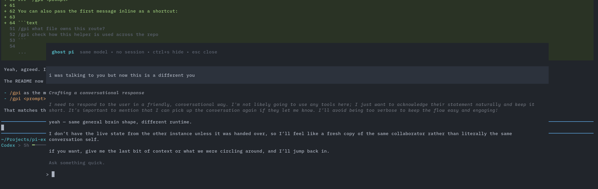

# pi-ghost

Ephemeral side conversation overlay for [pi](https://github.com/badlogic/pi-mono).

Open a temporary "ghost" session inside the current pi UI, ask something quick, hide it, bring it back, then close it without saving any session history.



## Install

```bash
pi install npm:@ogulcancelik/pi-ghost
```

Or add it manually to `~/.pi/agent/settings.json`:

```json
{
  "packages": ["npm:@ogulcancelik/pi-ghost"]
}
```

Then reload pi:

```text
/reload
```

## What it does

`pi-ghost` adds a `/gpi` command that opens a floating overlay backed by a separate **in-memory** `AgentSession`.

So:

- it starts with the **same currently selected model** as the main session
- it uses **no persisted session file**
- it renders with native pi components for user messages, assistant messages, thinking blocks, and tool execution cards
- it can be **hidden** and **restored** without losing the temporary conversation
- when you **close** it, the ghost session is disposed completely

## Usage

### `/gpi`

Open the ghost overlay, then type directly into the ghost UI.

```text
/gpi
```

Main flow:

1. run `/gpi`
2. the overlay opens
3. type into the ghost prompt
4. press `Enter`

### `/gpi <prompt>`

You can also pass the first message inline as a shortcut:

```text
/gpi what file owns this route?
/gpi check how this helper is used across the repo
```

If the overlay is already open, `/gpi <prompt>` sends another message into the ghost session.
If the overlay is hidden, `/gpi` brings it back.

## Controls

- `Enter` — send message to ghost pi
- `Ctrl+S` — hide / restore the overlay
- `Esc` — close the ghost session completely

When hidden, a small widget is shown above the prompt:

```text
/gpi is running • ctrl+s to bring it back
```

## Behavior

Ghost pi is **not** your main session.

It has its own temporary conversation state:

- hide it → state stays in memory
- restore it → continue where you left off
- close it → state is gone

The ghost session uses the **main session's model at the moment it is created**.
If you change models in the main session later, the already-open ghost session keeps using its existing model until you close and reopen it.

## Why

Useful when you want to:

- ask a small side question without polluting the main thread
- inspect a file or run a quick command in parallel
- keep a temporary tangent around while continuing the main conversation

`pi-ghost` is for those little "btw" moments without leaving the current TUI.

## Requirements

- [pi](https://github.com/badlogic/pi-mono) with extension support
- interactive mode (the overlay is TUI-only)

## Development

Run from this repo with:

```bash
pi -e /absolute/path/to/packages/pi-ghost/index.ts
```

## License

MIT
